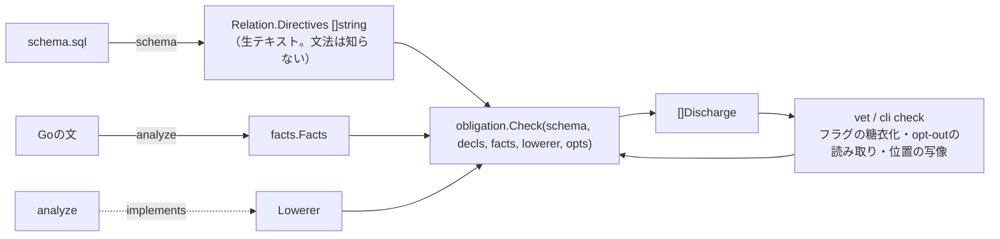

# 義務（obligation）— 境界の規則を一つの仕組みにする

状態: 実装中。段3（既存3規則の載せ替え）まで完了し、判定は`internal/obligation`に一本化されている。[design.md](design.md)の「検討中」から参照される。段4以降が落ち着いたら本文を「決めたこと・理由・棄てた案」の形に書き換え、design.mdの核となる裁定に昇格する。

## 動機

今ある境界の規則は3つで、それぞれ別の入口と別の実装を持つ。

| 規則 | 宣言の場所 | 実装 |
|---|---|---|
| `-- sqlshape: visible where <expr>` | schema.sqlの表 | `internal/analyze` `checkVisibility`（proverの事実を使う） |
| `-require-columns=tenant_id` | vetのフラグ（全表一律） | `internal/vet` `vet.go` + `rls.go`（`pinsColumn`、独自のAND走査） |
| `-no-table-reads` / `-no-tables` / `-schemas` | vetのフラグ | `internal/vet` `vet.go`（参照の種別を見る） |

「ポリシーが列を固定していれば`-require-columns`を満たす」「ビューが述語を運べば`visible where`を満たす」のような特例が規則ごとに個別に書かれている。次に来る要求 — 表をまたぐ制約（`order_items`は`orders`とtenantを揃えて結合する）、列の不変性（`tenant_id`をUPDATEしない）、表単位の「ビュー経由でしか読まない」— を同じ調子で足すと、規則の数だけ特例が増える。

ここで扱う3つも、次に来るものも、全部同じ形をしている。**表（ビュー・スキーマ）が参照側の文に義務を課し、文から導いた事実がその義務を履行するかを判定する。** この形を仕組みとして持ち、個々の規則はその上の宣言にする。

## 3層

### facts — 文から導く事実

文（展開ごと）について、以下を導く。`One`の証明器（`internal/analyze/card.go`の`prover`: `fix` / `equate` / `fixpoint`）がすでに等値の部分を持っていて、これが核になる。

- 等値: `col = $n`、`col = const`、`a.col = b.col`（WHERE・JOIN ON・USING由来）。ユニオン・ファインドで閉包を取る
- NULL性: `col IS NULL` / `IS NOT NULL`が含意されるか
- 参照集合: どの表・ビュー・関数を、どの役割（読み / 書き込みターゲット / RETURNINGのみ）で触るか
- 書き込み集合: INSERTで代入される列、UPDATEのSETに現れる列
- 閉包規則（FK伝播）: `items.order_id = orders.id`が事実にあり、FK `items(order_id, tenant_id) → orders(id, tenant_id)`があれば`items.tenant_id = orders.tenant_id`を加える。参照先が一意だから成り立つ。複合FKの残りの列すべてに適用する
- 継承: ビューを読む文は、ビュー定義から導いた事実を継承する。RLSポリシーのUSING式は、行セキュリティの対象ロールに対する事実として加える（所有者に対しては`FORCE ROW LEVEL SECURITY`がある場合のみ）

事実は「証明できるもの」だけを持つ。OR・関数呼び出し・不等号の先は追わない。`One`の証明と同じ態度で、追えないものは「証明できない」として扱う。

### obligations — スキーマ側が宣言する義務

宣言はschema.sqlのコメントに置く（schema.sqlが唯一の定義、という裁定に揃える）。表・ビュー・スキーマに付き、スキーマに付けたものはその中の全表に効く。

```sql
-- sqlshape: require <obligation> [on <kinds>]
```

`<kinds>`は文種のリストで、`select` / `insert` / `update` / `delete`（`merge`は各枝をその文種として扱う）と、まとめ書きの`read`（= select と書き込みの読み出し部分）/ `write`（= insert, update, delete）/ `all`。楽観ロックのように「UPDATEとDELETEだけ」がある以上、read / write / allの三択では足りない。

`<obligation>`はSQLのboolean式か、少数の組み込み述語。

| 宣言 | 意味 | 今の相当物 |
|---|---|---|
| `require deleted_at IS NULL on read` | 読みの各展開で、この表の行がこの述語を満たすと含意されること | `visible where` |
| `require pinned(tenant_id)` | 読み・UPDATE・DELETEでは`tenant_id`が`$n`か定数に等値で固定されること。INSERTでは代入されること | `-require-columns` |
| `require pinned(version) on update, delete` | 楽観ロック。UPDATE / DELETEのWHEREに`version = $n`が現れること。下記「例: 楽観ロック」 | なし |
| `require immutable(tenant_id)` | UPDATEのSETに現れないこと | なし |
| `require via view` | 文がこの表を直接参照しないこと（書き込みターゲットは許す） | `-no-table-reads`の表単位 |
| `require via view on all` | 書き込みも含めて直接参照しないこと | `-no-tables`の表単位 |
| `require EXISTS (SELECT 1 FROM orders o WHERE o.id = order_id AND o.tenant_id = tenant_id)` | 表をまたぐ述語。ここで初めて複数表の規則が同じ枕で書ける | なし |

`pinned`をSQL式で書けないのは「何かの値に等しい」が式にならないからで、`immutable`と`via view`は文の述語ではなく文の構造についての述語だから。組み込みはこの種類 — 文の構造述語 — に限り、増やす前に「SQL式で書けないか」を問う（候補は「掘り先」）。

デフォルトの`on`は述語なら`read`、`pinned`は`all`（読みとUPDATE / DELETEは固定、INSERTは代入）、`immutable`は`update`、`via view`は`read`。

opt-outは今と同じで文側に置く。`-- sqlshape: unfiltered memos`は`-- sqlshape: waive memos`のような一般形に寄せる（名前は要検討）。opt-outした文は診断に残る（`-strict`で一覧できる）。

### discharge — 履行の判定と経路

判定は一本: **facts ⇒ obligation**。述語型の義務は、義務の式を事実の言語（等値・NULL性）に落として含意を問う。落とせない部分（`x > 0`のような不等号）は、文のWHEREに同じ式が構文的に現れるかで判定する（今の`sameExpr`の路線）。構造型（`pinned` / `immutable` / `via view`）は参照集合・書き込み集合を見る。

履行の経路は5つで、今バラバラの特例がここに集まる。

1. 文自身がWHERE・ON・SETで満たす
2. ビュー経由: ビュー定義の事実を継承して満たす（`visible where`をビューが運ぶ、の一般化）
3. ポリシー経由: RLSのUSINGが満たす。所有者への注記は今と同じ
4. FK伝播: 結合先で満たされた義務が、複合FKの等値を通してこの表にも届く（`orders.tenant_id`が固定されていれば`order_items.tenant_id`も固定されている）
5. opt-out

証明できなければエラー。証明できないのは、義務が強すぎるか、スキーマに一意性・FKが足りていないかの発見になる（`One`と同じ）。

## 例: 楽観ロック

```sql
-- sqlshape: require pinned(version) on update, delete
CREATE TABLE orders (
  id      bigint PRIMARY KEY,
  ...,
  version int NOT NULL DEFAULT 1
);
CREATE TRIGGER orders_bump_version BEFORE UPDATE ON orders
  FOR EACH ROW EXECUTE FUNCTION bump_version();  -- NEW.version := OLD.version + 1
```

```go
var Update = sqlshape.One[struct{}, struct{ ID int64; Version int32; ... }](`
UPDATE orders SET status = {{.Status}} WHERE id = {{.ID}} AND version = {{.Version}}`)
```

3つの部品に分かれ、それぞれ既存の仕組みに乗る。

- 静的: `pinned(version) on update, delete`が「WHEREに`version`を入れ忘れた文」を止める。新しい組み込み述語は要らない
- DB: インクリメントはトリガが行う。`SET version = version + 1`を文に要求する案は棄てる。書き込み集合の事実に`NEW.version = OLD.version + 1`のような形が要り、義務の言語がトリガの領分に広がる。DBが守れるものはDBに（RLSと同じ裁定）
- 実行時: `One`で宣言したUPDATEは`Single.Exec`が0行で`ErrNoRows`を返す。「行が消えた」と「誰かが先に更新した」は同じ0行で文からは区別できないので、`ErrStale`のような別エラーは作らない

ORMの`lock_version`（Rails）/ `@Version`（JPA）は条件と加算の両方を注入する。sqlshapeでは「書かせる（pinned）+ DBが上げる（トリガ）+ 0行を検出する（`One`）」に分解される。

## 例: DDDの集約

集約は新しい層ではなく、**義務の束を生成するマクロ**として乗せる。`-require-columns`が`pinned`の糖衣であるのと同じ位置。

```sql
-- sqlshape: aggregate orders (order_items, order_notes)
```

DDDが集約に言わせている規則は、既存の義務に展開される。

| DDDの規則 | 展開先 |
|---|---|
| 子はルート経由でしか触らない | 子表に`require pinned(order_id) on all`。ルートの`id`が固定されたJOINがあればFK伝播で履行される |
| 集約全体が一貫性の単位（ロックもルート単位） | ルートに`version`、子表に`require EXISTS (SELECT 1 FROM orders WHERE id = order_id AND version = $n) on update, delete`。加算はトリガで子→ルートに伝える |
| 他の集約はIDでだけ参照する | 集約の各表に`require alone`（同じ文に他の集約の表を含めない）。参照集合を集約の分割で見る構造型の述語 |
| 子の識別はルート従属 | 義務ではなくスキーマの形。`(order_id, seq) PRIMARY KEY`と`ON DELETE CASCADE`を`-strict`の助言にできる |
| 集約内の不変条件（明細合計 ≤ 上限） | 行をまたぐのでDB側。トリガかdeferred constraint。義務の外 |

帰結。

- **集約をまたぐ読みはビューで**。`alone`は表への直接参照を見るので、複数集約を結合した読みモデルはビューとしてschema.sqlに置き、それを読む。「DBが型付きAPIを出す」路線（examples/3-database-api）とそのまま接続する。CQRSの読みモデル = ビュー
- **書き込みは1文1集約**が`alone`で機械的に守られる。ただしこれは文単位の射影で、「1トランザクションで2集約を書く」は文が分かれていれば通る。集約の本来の意味はトランザクション境界なので、守れるのは文の形に映る分だけ。文をまたぐ層は未決のまま
- `aggregate`宣言を残す価値は意図の保存にある。義務を個別に書くと「なぜこの5行が揃っているか」が消える。展開結果は診断文に使う（`order_items は集約 orders の子: order_id を固定してください`）

## 掘り先: 文の形に映るアプリケーションの意味

義務の枠組みに乗り、facts に文の形（SETの定数、選択列集合、LIMITの有無、CTEの書き込み集合）を足すだけで書けるもの。含意判定は変わらない。

### 値のライフサイクル

- **状態機械**: `-- sqlshape: transitions status: draft -> submitted -> paid | cancelled`。`UPDATE ... SET status = 'paid'`はWHEREで`status = 'submitted'`を固定していなければエラー。CASを強制し、遷移の競合を静的に潰す。遷移表をseed済みlookup `(from_status, to_status)`として置けば宣言がSQLになり、トリガでDBも守り、checkerはseedを読んでWHEREを要求する（enumよりlookupの裁定と噛む）
- **append-only**: `require never on update, delete`。台帳・イベント表。その文が存在しないことを保証する
- **immutable**: 既出。`created_at`、外部キーの付け替え禁止

### 同時出現

- `require together(amount, currency) on select`: 片方だけSELECTする文を止める。金額と通貨、値と単位、`(kind, ref_id)`のポリモーフィック参照
- **outbox / 監査ログ**: `require paired(outbox) on insert`。書き込み集合に`outbox`が含まれなければエラー。書き込みCTE（`WITH ins AS (INSERT ...) INSERT INTO outbox ...`）なら1文で済むので、**「文をまたぐ」問題の一部は「1文にまとめろ」という義務に変換できる**。トランザクション層を作らずに、集約をまたぐ書き込みの原子性を文の形で守れる

### アクセスの形

- `require bounded on select`: LIMITかキーセット条件のない全件走査を止める（大きい表）
- `require single on delete`: `One`で証明できる形のDELETEしか通さない（一括削除事故）
- `require indexed`: `-strict`の助言「述語に効くインデックスがない」を、ホットな表だけエラーに昇格

### データ分類

列に`-- sqlshape: sensitive pii`を付け、選択列集合を見て、その列を読めるpackageを`-may-read=pii`で絞る。またはマスク済みビュー経由のみ。`-schemas`のパッケージ単位フラグと同じ構造。

### Go側との束縛（層をまたぐ）

`pinned(tenant_id)`の相手が、Goのnamed type `TenantID`に束縛されたパラメータであることまで要求する。束縛は使用箇所から導く既存機構で、`TenantID`を認証コンテキストからしか作れないようにすれば「tenantを固定している」から「**正しい**tenantを固定している」に一段上がる。sqlshapeがGoの型を見る唯一の層をここに使う。

### 裁定への影響

組み込み述語が増える（`never` / `together` / `paired` / `bounded` / `single` / `indexed` / `alone`）ので、「組み込みは3つに留める」は捨て、**SQL式で書けないものは文の構造述語として名前を持つ**に変える。増やす前に「SQL式で書けないか」を問う規律は残す。一番効くのは状態機械とoutbox。前者は業務ロジックの大半を、後者は集約とトランザクションの隙間を埋める。

## 文脈: vetの外の文にも義務を課す

アナライザーはpure Goで文単位なので、`sqlshape check -schema schema.sql < query.sql`のような入口を足せば、Goコードの外の文にも同じ判定が効く（今のCLIは`diff` / `apply` / `verify-schema`だけで、アナライザーの入口はvetに限られている）。

それで開くもの。

- **運用の手作業SQL**: 本番で叩くUPDATE / DELETEを`check`に通してから流す。`single on delete`・`never`・`pinned(tenant_id)`・状態機械のCASが、手で書いた1行にも効く
- **backfillを`apply`の中で**: `up.sql`に混ぜるDMLを、DDLの終点比較と同じく検査する
- **psql / DBプロキシのゲート**: 通った文だけDBに渡すラッパー。RLSが効かないowner接続でも`pinned`が代わりに守る
- **LLMエージェントのSQLツール**: 「実行できる文の範囲」を、プロンプトで頼むのではなくschema.sqlの義務で証明して与える。`sensitive`で読める列を絞り、`bounded`で全件走査を止め、`alone`で集約をまたがせない
- **分析者・BI**: 読み専用の文脈で`bounded` + `sensitive` + ビュー経由。診断文がそのまま読み方のガイドになる

### 義務のスコープは「package」から「文脈」へ

今の`-schemas`や「掘り先」の`-may-read`はパッケージ単位のフラグだが、かき捨ての文にはpackageがない。代わりに実行ロール（`SET ROLE`）や呼び出し元（ops / agent / analyst）が単位になる。両者を「文脈（context）」で揃える。

```sql
-- sqlshape: context ops: waive bounded; require single on delete
-- sqlshape: context analyst: require via view; may read pii = false
```

- schema.sqlに文脈ごとの義務の差分を宣言する（基底の義務は表に付いたまま）
- vetはpackageを文脈に写す（`-context=ops`、または命名規則）
- `check`は`-context`で選ぶ
- opt-out（`waive`）はかき捨てでは「誰が外したか」が要る。`check`の出力（どの文がどの義務をどの経路で履行し、何を外したか）をそのまま監査ログにする

2-way SQL（`/*{{.X}}*/'lit'`、design.mdの検討中）はここに繋がる。psqlでそのまま流せるテンプレートなら、Goのテンプレートとかき捨ての文が同じ文法になり、`check`の入力にそのまま使える。

## ORMの制約との対応

ORMが一枚のクラス定義に混ぜて置いている制約は、この枠で3つに分別される。

| ORMの機能 | 行き先 |
|---|---|
| validates presence / inclusion / uniqueness、belongs_to、enum | schema.sqlのNOT NULL / CHECK / UNIQUE / FK / lookup。DBが守り、sqlshapeは失敗モード（expect行）として扱う |
| default_scope、acts_as_tenant、Hibernateの`@Where` / `@Filter`、readonly属性、`@Immutable`、`lock_version` / `@Version`の条件側 | obligation。ORMは条件を**注入**するが、sqlshapeは**書かせて検証する**（SQL as SQLの裁定。文を書き換えない） |
| dependent: :destroy、counter_cache、touch、after_saveコールバック、`lock_version`の加算側 | 文をまたぐ振る舞い、または行の派生値。DB側ならCASCADE / トリガ。そうでなければ分析単位が文である限りスコープ外 |

「データの不変条件はDB」「文の形の規約はobligation」「文間の振る舞いはスコープ外かトリガ」。RLSの裁定（DBが絞れるものはDBに、文に繰り返させない）の延長にある。

## 決めること

- 義務の言語はSQL式 + 文の構造述語（`pinned` / `immutable` / `via view`が最初の3つ、「掘り先」の分が続く）。述語型はSQL式で書き、SQL式で書けないもの（文の構造についての述語）だけが組み込みになる。理由: 含意判定エンジンが1つで済み、`EXISTS`で表をまたぐ規則が追加機構なしに書ける
- 含意判定の強さは、等値・NULL性・FK閉包の可決定な断片に限る。それ以上は構文一致にフォールバックし、それでも証明できなければopt-outを要求する
- 宣言はschema.sqlに置き、フラグは互換のために残す（`-require-columns=tenant_id`は「`tenant_id`列を持つ全表に`require pinned(tenant_id)`」の糖衣）

## 未決

- ~~opt-out行の名前と粒度~~ → `waive <table> [<body>]`。義務単位（bodyを宣言どおりに綴る）と表単位（省略）の両方。`unfiltered`は述語型だけを外す別名として残す
- 関数本体（PL/pgSQL）の中の文に義務を課すか。関数を`via view`の履行経路に数えるか（「ビューと関数だけを読む」の`-no-tables`は関数を許している）
- ビューに義務を付けたとき、ビューの定義文自身に課すのか、ビューの読み手に課すのか。両方ありうる（`require pinned(tenant_id)`をビューに付けたら読み手への義務、`require via view`を表に付けたらビュー定義が履行経路）
- 文をまたぐ規則（「accountsをUPDATEしたら同一トランザクションでledgerにINSERT」）を扱う層を持つか。持つならGo側で`pgx.Tx`上の呼び出し集合を`go/analysis`で集める別層で、「核はSQLしか見ない」と緊張する。ここでは扱わない
- FK伝播をNULL性と`One`の証明にも使うか（RLSの項の「未対応」と同じ話）
- 「掘り先」の各述語の優先順位。状態機械とoutboxを先に
- 文脈の宣言構文と、vetでpackageを文脈に写す方法（フラグか命名規則か）。`check`でのパラメータの扱い（`$n`なしのリテラル文をそのまま受けるか、2-way SQLを要求するか）
- ~~集約から共通に参照してよいlookup表の印~~ → どの集約にも属さない表は`alone`の対象外（宣言不要）
- 集約の入れ子（子の子）への伝播。`pinned(order_id)`を孫にもFK経由で要求するか、直接の親の鍵で足りるとするか

## 境界: コアから切り離す

義務はアドオンで、PostgreSQL / MySQLのどちらにも属さない。核（アナライザー・スキーマ・vet）との接点を3つの契約に固定し、義務の実装はその上で閉じる。



| package | 依存 | 役割 |
|---|---|---|
| `internal/facts` | なし | データ契約。文種・スコープの木・葉（表・別名・役割・位置）・正規化述語・等値類・固定列・NULL拒否列・代入集合。パーサのノードを含まない |
| `internal/obligation` | `facts` `schema` | 宣言の文法、フラグからの展開、含意判定、FK閉包、履行経路の記録。`analyze`にも`vet`にも依存しない |
| `internal/analyze` | `facts` | 判定の代わりにFactsを出す。`recordFixed`が`checkVisibility`を呼んでいる場所が生産点。ビュー本体とポリシーのUSINGも同じ形で葉に付ける（`Origin`で区別） |
| `internal/vet` / `internal/cli` | `obligation` | 入口。`-require-columns=tenant_id`を`Pinned("tenant_id")`の宣言列に、`-no-table-reads`を`ViaView`に展開して渡す。文の`waive`行を読んで葉に付ける。`Discharge`を診断に写す |

**正規化述語（`facts.Pred`）が共通言語。** `Eq(col, Param | Const | Column | Known)` / `IsNull` / `IsNotNull` / `Opaque(正準テキスト)`。文のconjunctも、ビューの述語も、RLSのUSINGも、宣言のSQL式も、全部これに落ちる。落とすのは方言側の仕事（`obligation.Lowerer`インターフェースをanalyzeが実装する）で、obligationは含意しか判定しない。`Opaque`同士のテキスト一致が、今の`sameExpr`にあたる構文フォールバック。

方言を足すときに要るのは「Factsを出すアナライザー」と「Lowerer」の2つで、宣言の文法・判定・診断はそのまま使える。

**schemaは文法を知らない。** 今は`schema.go`が`visible where`をExprに、ビューの`unfiltered`をmapに解釈し、未知の指示行をProblemにしている。これをやめ、`-- sqlshape:`行を`Relation.Directives`に生で溜める。未知の文法の報告はobligation側の`Problem`に移る。`Relation.Visible`の読み手は`checkVisibility`だけ（diff / applyは見ていない）なので、移すのに障害はない。ビューの`unfiltered`は「ビュー定義文のopt-out」で、文側の`waive`と同じもの。Factsのビュー葉に`Waived`として載る。

**Factsはスコープ単位。** `visible where`は今もサブクエリの各レベルで葉ごとに判定している。フラットにすると「外側のWHEREは内側の葉を絞らない」の区別が消えるので、スコープの木をそのまま持つ。外部結合のONがnull側しか絞らない制約は`Pred.Restricts`で運ぶ（proverの`allow`と同じ）。

**判定は全数を記録する。** `Discharge`は失敗だけでなく、どの経路（文自身 / ビュー / ポリシー / FK / waive）で履行されたかを全部返す。vetは失敗だけを診断にし、`sqlshape check`は全数を監査ログとして出す（「文脈」の節の要件）。

## 移行

0. 契約の型だけ切る: `internal/facts`、`internal/obligation`（`Check`は未実装）。済
1. analyzeがFactsを出す。判定は従来のまま。Factsのスナップショットテストを足す。既存テストは無変更で緑。済（`internal/analyze/facts.go`、`TestFacts`）。MERGEのONも一つのスコープとして出る（今の`checkVisibility`はMERGEを見ていないので、段3で載せ替えるとMERGEにも`visible where`が効くようになる。意図した拡張として受け入れる）
2. obligationの中身: `require`文法、`Pinned` / `Immutable` / `ViaView`、含意エンジン、FK閉包、ビュー・ポリシー継承。schemaと手書きFactsだけで回る単体テスト
3. 3規則を載せ替える。`visible where`は`Predicate on read`の別名、`-require-columns`は`Pinned`、`-no-table-reads` / `-no-tables`は`ViaView`。`checkVisibility`と`vet/rls.go`を削除し、schemaは`Directives`を溜めるだけにする。診断文は据え置き、`internal/vet/testdata`と`policy_test.go`が回帰を押さえる。**ここが「アドオンをコアから切り離す」の完了点**。済。`internal/vet/testdata`は無変更で緑。`policy_test.go`は`obligation/visible_test.go`に移した。載せ替えで変わった振る舞い（意図した拡張）: (a) MERGEのONにも`visible where`と`pinned`が効く、(b) 判定が表単位から葉単位になった（自己結合・サブクエリの各出現がそれぞれ義務を負う。`-require-columns`は以前、文中のどこかで固定されていれば同じ表の他の出現も通していた）、(c) `visible where`をRLSポリシーのUSINGが履行できる（経路3。所有者への注記は`-strict`で出る）、(d) 複合FKで結合先の固定が伝播する（経路4）。schemaのseed文（`schema.CheckStatement`）からは`visible where`の判定が外れた — seedはINSERT VALUESに限られ読みを持たない
4. 新機能: `on <kinds>`、`Immutable`、表をまたぐ`EXISTS`、`waive`の一般形。済。`on` / `immutable` / `via view`の表単位は段2の実装で動いており、docs（checks / templates / flags）に書いた。`waive <table> [<body>]`を文側とビュー定義側に足した（bodyは宣言どおりの綴り、省略で全部、`unfiltered`は述語型だけの別名）。opt-outは`Discharge`に`Waived`として残り、vetは`-strict`で報告する。表をまたぐ`EXISTS`は構文一致（Opaque）で判定できる段階で、含意（サブクエリの事実）は未対応
5. `aggregate`宣言と`alone`。義務への展開だけで、判定側には手を入れない。済（`alone`だけは判定側に構造述語として足した: 文が触る表集合を集約の分割で見る）。展開は子表への`pinned(FK列)`と全表への`alone`。ルート`version`の`EXISTS`義務（ロックをルート単位にする）は入れていない — サブクエリの含意が要るので、表をまたぐ`EXISTS`の判定と一緒に
6. `sqlshape check`と文脈。判定は共有し、入口とスコープの写像だけを足す

段3までユーザーに見える振る舞いは変わらない。以降はobligationパッケージの中で閉じる。
